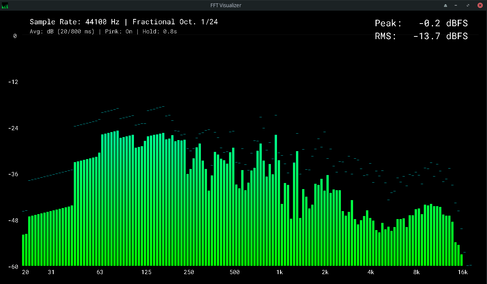

# C FFT Visualizer

Visualize the Fast Fourier Transform (FFT) of audio signals in real-time using C, FFTW3 and Raylib.

> [!WARNING]
> Early prototype.
> Only supports .wav audio files for now.
> Sample rates of 48kHz and higher will make the visualization lag relative to the audio.


## Requirements
- C Compiler
- [Raylib](https://www.raylib.com/)
- [FFTW3](http://www.fftw.org/)

Arch Linux:
```bash
sudo pacman -S clang raylib fftw
```


## Build and run
```bash
./build.sh

./build/c_fft_visualizer <path_to_audio_file> <--loop (optional)>
```

## Controls
- `O`: Change octave scaling
- `C`: Cycle through color gradients
- `F11`: Toggle fullscreen


## Screenshot


## License
MIT License